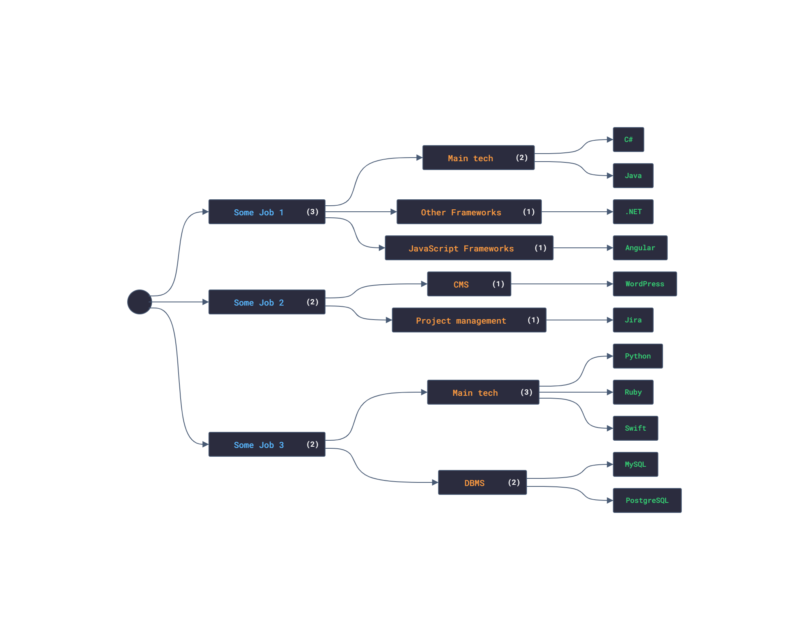

# Web-Scraping-Project

This project aims to represent in graphic form the web technologies most used in business web projects in many differents countries. The data comes mainly from jobboards: LinkedIn and Indeed.

## Requirements

You need to install some Python packages to run this project, execute the command below to install them.

```bash
pip install -r requirements.txt
```

## Run project

To run the LinkedIn scraper, execute `main.py` Python file in `scrape_LinkedIn` folder.  

To run the technologies analysis process, execute `main.py` Python file in `jobs_analytics` folder.

## Jupyter Notebooks

You have at your disposal an offline version of a Jupyter Notebook to visualize data in graphical form, this Notebook is listed in the `data folder`, the data comes from a CSV file, which has been dumped from the jobs_offers table of the database.  

In the future, I will put this database online on Google Cloud Platform in order to have a online Jupyter Notebook that will be directly linked to the MySQL database.

### JSON structure generated by technologies analysis process

This is a JSON structure generated by the technologies analysis process. This data is simply extracted from the description of the job offer.  



### Here are some relevant plots that were generated during the data analysis.

")

")

")

")
